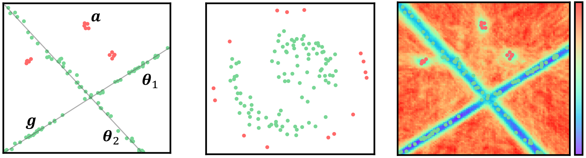

# RuzHash-iForest demo
## Steps
### 1. Clone repo locally
### 2. Install dependncies contained in the requirements.txt file
### 3. Execute RuzHash-iForest_demo.py to produce an image similar to the following one

### Image taken from:
### "Filippo Leveni, Luca Magri, Cesare Alippi and Giacomo Boracchi. "Hashing for Structure-based Anomaly Detection." 2023 22nd International Conference on Image Analysis and Processing (ICIAP)."
