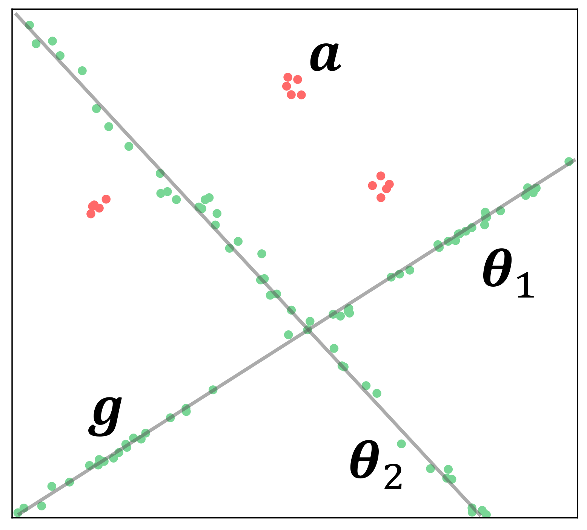
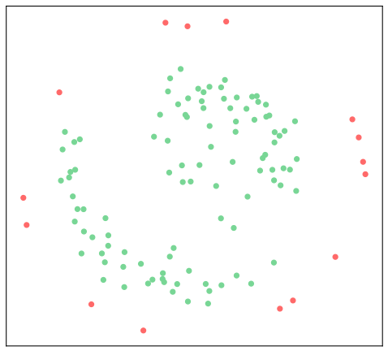
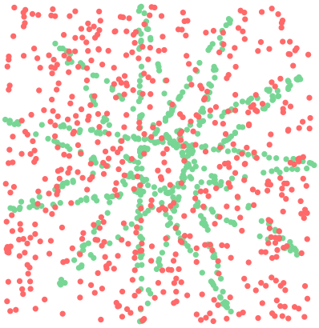
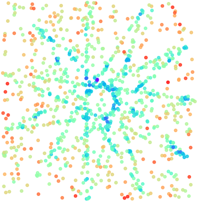
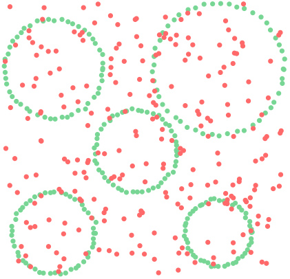
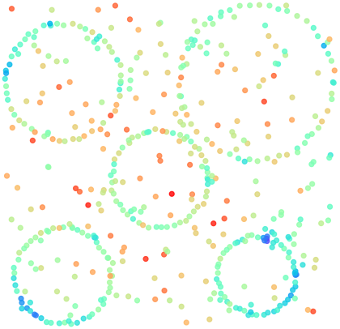
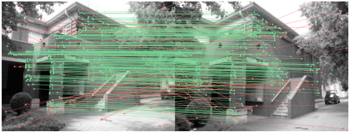
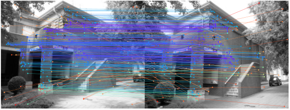
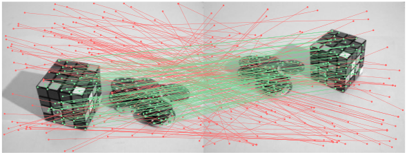
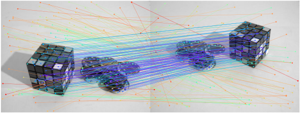

# Hashing for Structure-based Anomaly Detection

### Structure-based Anomaly Detection
Given in input a set of points, a subset of which has been generated by a family of parametric models (the genuine points), and the remainder supposed to be generated by a different family (the anomalous points), the aim is to produce a score that ranks anomalies first.

  
   
  <!--img src="./images/overview/data_scores_modified.svg" height="150" /-->
  

In the image on the left we can see an example of genuine points (in green) and anomalous points (in red).
In this example the family of models that generated genuine points is the one of the lines, while the family of models that generated anomalous points is the one of the gaussian distributions.
We approach our anomaly detection problem in two steps: (i) we perform an embedding and map points to an high dimensional space, called Preference Space, through the Preference Embedding procedure, and (ii) we perform an isolation-based anomaly detection procedure specifically designed for that space: RuzHash-iForest.
The central figure represents the dimensionality reduction of the points after being mapped to the Preference Space. We can observe that Preference Embedding maps points that belongs to the genuine family of parametric models to high density regions, while the remainder to low density regions.
The image on the right represents the heatmap of the anomaly scores computed by RuzHash-iForest. Altough RuzHash-iForest works directy in the Preference Space, we are able to map back the scores to the ambient space retaining the correspondence between the point before and after the mapping. We can see that the regions that are closer to the lines are associated to a lower anomaly score, and viceversa.

### Synthetic data

  
  
  &nbsp;&nbsp;&nbsp;&nbsp;&nbsp;&nbsp;&nbsp;&nbsp;&nbsp;&nbsp;&nbsp;
  
  

Above we can see on the left our algorithm executed on a dataset in which 11 lines are present, and the corresponding anomaly scores.
Our approach is extremely general. In fact, we are not restricted to work only with a specific family of models, e.g., lines, but we can deal with any model family.
On the right we can see our algorithm executed on a dataset in which the genuine family is the one of circles, and the corresponding anomaly scores.

### Wrong matches filtering

  
  

  
  

Given a couple of images and a set of correspondences between pixels of the two images, wrong matches filtering consists in finding those correspondences that are wrong, i.e., that connect two pixels that are not referred to the same underlying object point.
The images above show the ground truth on the left and the anomaly scores our algorithm gives to the matches on the right. It is interesting to note that in these experiments the families of genuine models is different than before, and our algorithm is still able to work effectively.
In fact, the family of models that describes genuine correspondences is the one of the homographies in the images depicting a building, while the one of the fundamental matrices in the images depicting toys.

### Demo
In [this](PreferenceIForest) folder you can find a Python implementation of the RuzHash-iForest algorithm, together with its competitor PI-Forest (we renamed it Voronoi-iForest in our implementation).
In [this](RuzHash-iForest_demo.py) file you can find a demo of the RuzHash-iForest algorithm.
In order to play with the demo you just need to:
1. Clone the repo locally.
2. Install dependencies contained in the [requirements](requirements.txt) file.
3. Execute [RuzHash-iForest_demo](RuzHash-iForest_demo.py).

In [this](datasets) folder you can find the datasets on which the algorithm has been validated in [[1]](#1), while in [this](images) folder you can find the qualitative results.

#### References:
<a id="1">[1]</a>
Filippo Leveni, Luca Magri, Cesare Alippi and Giacomo Boracchi. "Hashing for Structure-based Anomaly Detection." 2023 22nd International Conference on Image Analysis and Processing (ICIAP).

